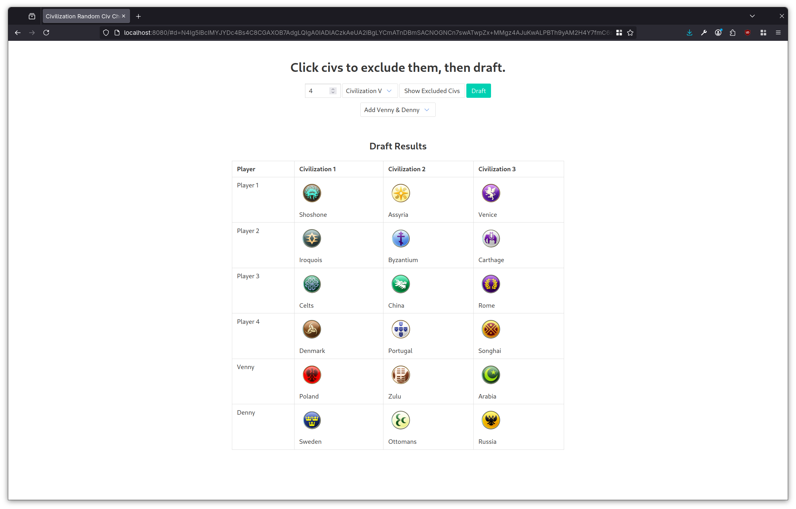

# Civilization V Draft Picker

Forked from <https://github.com/nocturnaltortoise/random-civ-picker>

This lets you pick a draft for Civ 5 multi‑player—three civs per player (plus two
extra for anyone who rolls Venice or Denmark).  
Toggle civs to disable them by clicking **Show Excluded Civs**.

Make sure to heed the Khall.

## TODO
* Add Civ VII
